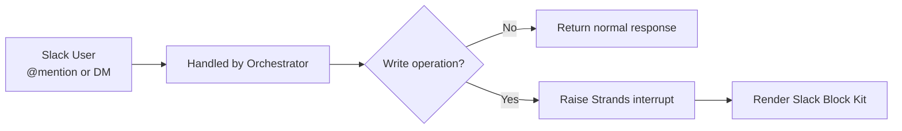
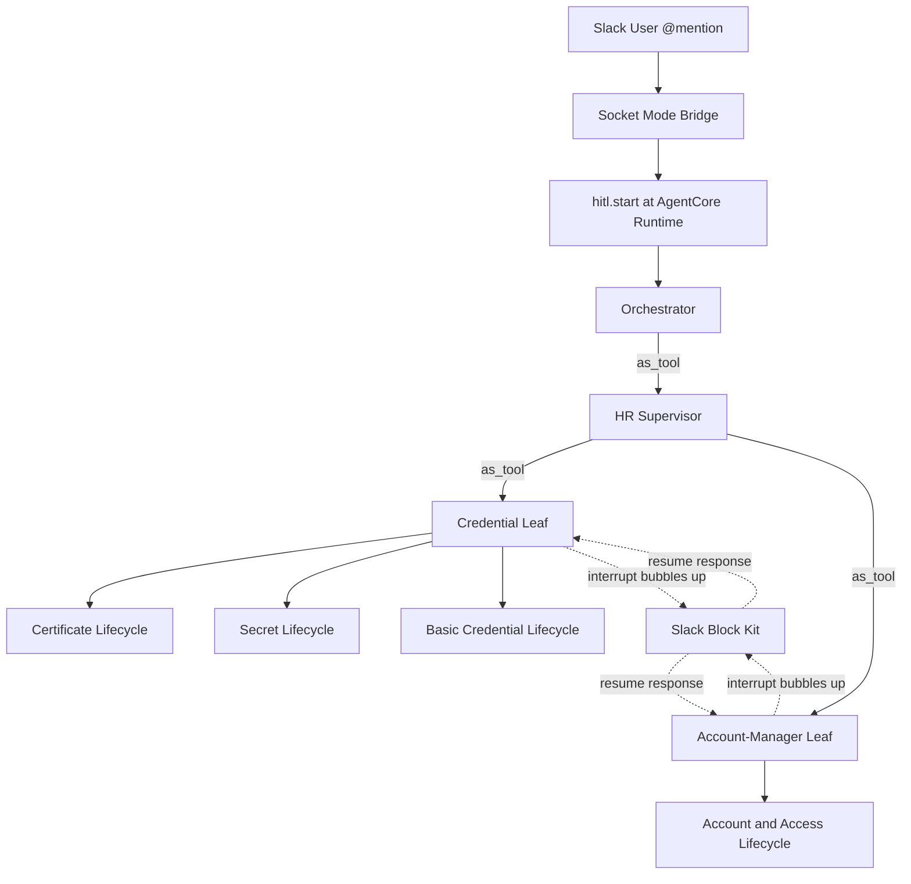

# Heuristic AI Brainstorming Session

<!--
오늘 세션은 Heuristic 하게 구성된 AIOps를 기준으로 의사결정 및 아이디어를 얻기위해 자리 마련했습니다.   
인증서 갱신, 유저 온보딩을 포함한 권한 관리등 필요 리소스등을 자동화하는 구성에 그룹장님의 아이디어를 기반으로 Human Resource Supervisor 를 기획했습니다.  

핵심 아이디어는 Human, Service account 등 인간과 서비스를 각각 고유 인증 정보를 가진 principal 객체로 추상화하여, credential lifecycle 을 agent hierarchy 하게 관리 하도록 했습니다.
-->


## Scope and Architecture

<!--

말씀 드린 HR supervisor 아래에는 cert leaf 와  account-manager leaf 2가지 하위 에이전트로 구성했습니다.  .
cert 는 credential/certificate lifecycle 을 담당하고, account-manager 는 principal 과 account inventory, onboarding 등 operation 및 validation을 담당합니다.  

-->

The repository remains intentionally minimal:

- Strands agents
- Bedrock model invocation
- AgentCore Runtime entrypoint
- Slack Socket Mode bridge
- Terraform runtime scaffold

Hierarchy (single runtime, in-process agents-as-tools):

```text
orchestrator (root)
└── supervisor: human-resource
        ├── leaf: credential
        └── leaf: account-manager
```

Agent tools by layer:

<!--
발표 대사:
여기서는 에이전트가 계층별로 어떤 역할을 맡는지 보여드립니다.
위에서 아래로 갈수록 라우팅에서 실행/검증으로 책임이 구체화됩니다.
-->

<!-- 발표 대사: orchestrator 는 요청을 직접 처리하기보다 HR supervisor 로 위임해 전체 흐름을 시작하는 관문입니다. -->
- orchestrator
   - `human_resource_supervisor` — Delegates HR/identity requests to the supervisor layer

<!-- 발표 대사: hr_supervisor 는 cert 와 account 작업을 분기하고, principal 기준 lifecycle 커버리지를 점검하는 조정자입니다. -->
- hr_supervisor
   - `cert_specialist` — Routes certificate lookup/renewal/replacement requests to the cert leaf
   - `account_manager` — Routes principal/account requests to the account leaf
   - `principal_lifecycle_auditor` — Verifies account, cert lifecycle manageability for a specific principal
   - `principal_type_coverage` — Verifies lifecycle coverage by principal type (is Ready for AI?)

<!-- cert leaf 는 각 인증 수단(인증서/시크릿/비밀번호)별 상태를 점검하고, 갱신 요청은 HITL 승인 interrupt 로 안전하게 멈췄다가 이어갑니다. -->
- credential_specialist (leaf)
   - `check_cert_expiry` — Checks certificate expiry/status for a domain
   - `check_credential_status` — Checks status for any credential (cert, secret, or password)
   - `list_credential_types` — Lists all supported credential types and renewal methods
   - `request_credential_renewal` — Renews/rotates/resets any credential with HITL approval

<!-- 발표 대사: account leaf 는 principal 인벤토리/검증을 담당하고, 생성·변경·삭제 같은 쓰기 작업은 모두 승인 후 의도만 기록합니다. -->
- account_manager (leaf)
   - `lookup_principal` — Looks up principal profile/owner/risk details
   - `list_accounts` — Lists accounts linked to a principal
   - `list_access` — Lists access grants for a principal
   - `list_credentials` — Lists credentials linked to a principal
   - `list_principals` — Lists all principals or filters by type
   - `list_linked_resources` — Lists certificates/secrets linked to a principal
   - `validate_onboarding` — Validates onboarding readiness (MFA/Slack + IAM permission gaps)
   - `validate_offboarding` — Validates offboarding risk
   - `find_stale_accounts` — Finds stale/offboarding/risky accounts
   - `propose_iam_terraform` — Detects IAM permission gaps and proposes `terraform-aws-modules/iam/aws` code (advisory)
   - `request_account_create` — Records account creation intent with HITL approval
   - `request_account_update` — Records account update intent with HITL approval
   - `request_account_delete` — Records account deletion/offboarding intent with HITL approval

## What Was Implemented in This Cycle

<!--
흐름을 살펴보면, 중간 인간의 검토가 필요한경우 단일 컨텍스트(FileSessionManager)내에서 Slack 을 통해 Interaction 하고 재개할 수 있도록 되어 있습니다. 자세한 컨셉은 이후 시연에서 공유드리겠습니다.  
-->

### 1) Agent-driven HITL workflows

The `@mention` or DM request flow is shown below.



인증서/시크릿/비밀번호 갱신 (credential leaf):

- `@sandbox-ai-app cert status <domain>` — 상태 조회 (읽기, interrupt 없음)
- `@sandbox-ai-app cert renew` — 도메인 없이 요청하면 `credential_selection` interrupt → `external_select`
  크레덴셜 선택기(인증서 scope) → 선택 후 `credential_renewal_approval` interrupt → managed_via 상세가 포함된 승인 카드
- `@sandbox-ai-app cert renew <domain>` — 도메인을 주면 선택 단계를 건너뛰고 바로 승인 카드
- `@sandbox-ai-app rotate <secret>` — 시크릿 rotation: `credential_selection` → `credential_renewal_approval`
- `@sandbox-ai-app reset password <principal>` — 비밀번호 초기화: `credential_selection` → `credential_renewal_approval` (IdP 경로 기록)

계정/principal (account leaf):

- `@sandbox-ai-app <principal> 조회` — lookup/list 계열 읽기 도구 (interrupt 없음)
- `@sandbox-ai-app <principal> 계정 생성|변경|삭제` — 각각 `account_create/update/delete` interrupt →
  승인 카드; 삭제는 연결된 인증서·시크릿 offboarding 체크리스트를 함께 표시

<!--
예시 흐름들이 많지만, 핵심은 인자 없이 "cert renew" 만 멘션해도 에이전트가 도메인을 되묻지 않고 곧장 크레덴셜 선택기를 띄운다는 점입니다.
선택하면 managed_via(SSH/ACM/AWS Secret/IdP) 상세가 담긴 승인 카드가 뜨고, 승인/취소 버튼으로 처리를 할 수 있습니다.
계정 삭제는 계정에 연결된 인증서, 시크릿, 비밀번호를 offboarding 체크리스트로 함께 보여주면서, 무엇을 회수해야 하는지 한번에 보여주며 유저 hop을 줄이고자 합니다.
-->

모든 대상 선택은 `Slack` - `external_select` 로 처리하며, 옵션은 Socket Mode 의 `block_suggestion` 리스너가 `build_hitl_options(...)` 로 제공합니다. 버튼/선택 payload 에는 secret 이 아닌 값(session,
interrupt_id, response)만 담기며, `credential_selection` 은 external_select 에 value 가 없어 resume
컨텍스트를 select 의 `block_id` 에 인코딩합니다. `block_id` json 에는 scope 힌트도 포함되어
인증서/시크릿/비밀번호 옵션을 분리해 제공합니다.


## Representative Lifecycle Examples

Representative examples naturally include principal lifecycle verification.
Manageable means the hierarchy can discover/list resources and route read or HITL-gated actions
across account, credential, certificate, and secret lifecycles (not that every resource is healthy).

<!--
발표 스크립트:
샘플 principal 을 유형별로 하나씩 준비했습니다.
service_account 인 deploy-bot 은 nginx_certificate 와 aws_secret 이 연결되어 있고,
application 인 payments-api 는 인증서와 secret 을 함께 봅니다.
workload 인 batch-runner 는 만료된 인증서를 탐지하는 케이스를 보여줍니다.
-->

- `new.engineer` (`user`, `human` category): onboarding lifecycle checks, pending basic credential
- `deploy-bot` (`service_account`): linked `nginx_certificate` + `aws_secret`
- `payments-api` (`application`, SA category): linked `acm_certificate` + `aws_secret`
- `batch-runner` (`workload`, SA category): expired certificate detection remains manageable
- `leaving.contractor` (`contractor`, `human` category): active basic credential — offboarding risk

<!--
시연은 세 가지 시나리오로: new.engineer onboarding 점검, 특정 주체에 대한 인증서 및 시크릿 갱신(회전) 요청.
첫 번째는 read-only 검증, 두 번째와 세 번째는 Slack 승인 기반 HITL 흐름입니다.

이후 validate 를 주기적으로 실행하며 권한 추가등의 작업을 Terraform PR, Slack 을통해 제시할 수 있습니다. 
-->

### Demo 1 — Onboarding readiness (`@sandbox-ai-app validate onboarding new.engineer`)

Slack (read-only check):

```text
@sandbox-ai-app validate onboarding new.engineer
```

Flow:

1. `@sandbox-ai-app validate onboarding new.engineer` → account leaf read tool(`validate_onboarding`)로 라우팅됩니다.
2. principal 상태와 누락 항목(MFA 미등록, Slack 계정 누락)에 더해 **IAM 권한 부족**(`base-engineering-readonly`,
   `dev-deployer-assume`)까지 함께 탐지해 반환합니다.
3. Read-only 경로이므로 interrupt 없이 최종 응답으로 종료됩니다.

<!--
발표 스크립트:
onboarding 점검은 MFA/Slack 뿐 아니라 IAM 권한 부족까지 탐지합니다.
"generate terraform for new.engineer" 처럼 이어서 요청하면 account leaf 가 propose_iam_terraform 도구로
terraform-aws-modules/iam/aws 모듈 기반 코드를 제시합니다 (advisory — 실제 apply 는 사람이 검토 후 IaC 파이프라인에서).
-->

(이어서) IAM 권한 부족을 Terraform 으로 닫기:

```text
@sandbox-ai-app generate terraform to fix IAM access for new.engineer
```

→ `propose_iam_terraform` 가 `iam-read-only-policy` + `iam-policy`(sts:AssumeRole) 모듈 블록을 HCL 로 제시합니다.
실제 변경은 없으며, 사람이 검토 후 적용합니다.

### Demo 2 — Certificate renewal via mention (`@sandbox-ai-app cert renew`)

<!--
대화세션은 Using file session storage: 와 같이 

도메인 없이 "cert renew" 만 멘션합니다. 에이전트가 도메인을 되묻지 않고 cert_selection interrupt 를 올려 external_select 인증서 선택기를 띄웁니다.
인증서를 하나 고르면 cert_renewal_approval interrupt 로 넘어가 managed_via(SSH 또는 ACM) 상세가 담긴 승인 카드가 뜹니다.
[승인] 을 누르면 nginx.internal 처럼 ssh 로 관리되는 인증서는 "certbot renew + nginx -s reload" 가 기록되고, acm_api 인증서는 ACM 갱신 요청이 기록됩니다. 실제 갱신은 없습니다.
-->

Slack (도메인 없이 멘션 → 선택 → 승인):

```text
@sandbox-ai-app cert renew
```

Flow:

1. `@sandbox-ai-app cert renew` → 에이전트가 `cert_selection` interrupt 를 올립니다 (아직 대상 없음).
2. Slack 이 `external_select` 인증서 선택기를 렌더링 (옵션은 `block_suggestion` 리스너가 제공) → 인증서 하나 선택.
3. 선택한 도메인이 tool 로 돌아가면 `cert_renewal_approval` interrupt 로 이어져 승인 카드가 표시됩니다:
   domain, ARN, account, region, status, expiration, renewal eligibility, renewal status, in-use,
   그리고 `관리 방식`(managed_via + management_endpoint) 라인.
4. `[승인]` → managed_via 경로가 기록됩니다: `ssh` → `certbot renew` + `nginx -s reload`,
   `acm_api` → ACM 갱신/재-import 요청 (sandbox: 실제 갱신 없음). `[취소]` → 변경 없음.

(선택) 도메인을 함께 주면 선택 단계를 건너뜁니다: `@sandbox-ai-app cert renew api.example.com`.

### Demo 3 — Secret rotation intent via mention (`@sandbox-ai-app rotate deploy-bot signing key`)

<!--
발표 스크립트:
시크릿 회전도 credential specialist 를 통해 처리됩니다. 에이전트가 credential_selection interrupt 를 올려 시크릿 선택기(secret scope)를 표시합니다.
승인 카드에서 rotation_enabled, last_rotated, days_since_rotation 필드를 확인한 뒤 승인하면 Secrets Manager rotation 요청 의도만 기록됩니다.
-->

Slack (자연어 멘션 → 선택/직접 지정 → 승인):

```text
@sandbox-ai-app rotate deploy-bot signing key
```

Flow:

1. `@sandbox-ai-app rotate deploy-bot signing key` → 에이전트가 credential_specialist 로 라우팅해
   `credential_selection` interrupt 를 올립니다 (secret scope). 옵션 value 는 `secret:<name>` 형식.
2. Slack 이 시크릿 선택기를 렌더링 → `deploy-bot-signing-key` 선택.
3. `credential_renewal_approval` interrupt: rotation_enabled, last_rotated, days_since_rotation,
   ARN, 관리 방식, 갱신 방법 필드를 포함한 승인 카드 표시.
4. `[승인]` → Secrets Manager rotation 의도가 기록됩니다 (sandbox: 실제 변경 없음).
   `[취소]` → 변경 없음.

## Diagram



<!-- Evaluator proposal content was moved to doc/evaluator-proposal-archive.md -->

## Next Steps for Discussion

<!--
발표 스크립트:
마지 막으로 논의하고 싶은 것은 어떤 시스템부터 read-only 로 연결할지,
실제 운영 환경에서 인증서는 어떤 종류의 갱신, 암/복호화 구조 및 프로세스를 가지고 있는지 POC 되어야 하는지  
On/Off loading 시 Human 계정에 대해 IAM 권한 외 

-->

1. Prioritize first real read-only integrations (IAM Identity Center, Organizations, ACM, Secrets Manager).
2. Define approval evidence requirements for each write-class operation.(각 쓰기 작업에 필요한 승인 증빙 요건을 정의합니다.)


   
