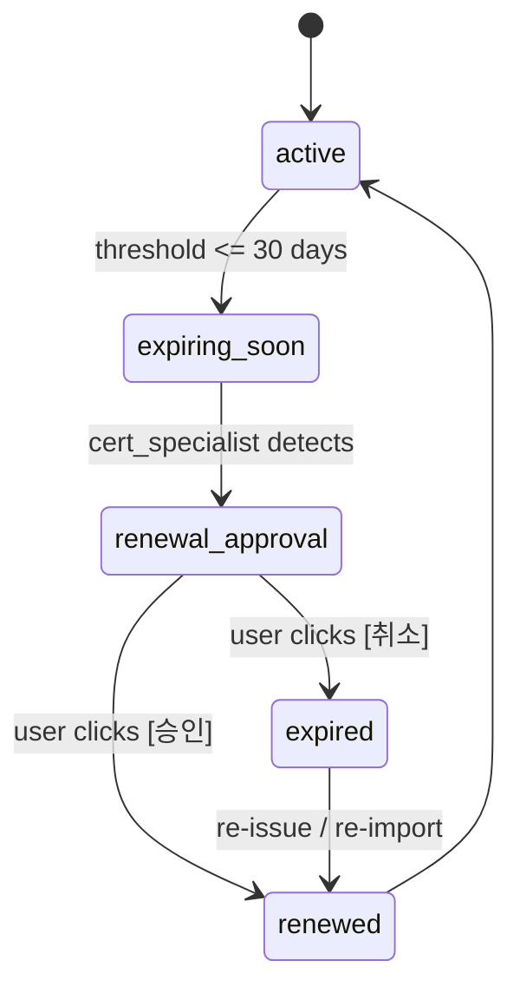

## Spec: Supervisor Agent — Human Resource

**Hierarchy:** supervisor  
**Parent:** root orchestrator (`spec_orchestrator_root-agent.md`)  
**Children:**  
  - cert leaf (`spec_leaf_cert-agent.md`)  
  - account-manager leaf (`spec_leaf_account-manager-agent.md`)  

**Spec path:** `doc/spec_supervisor_human-resorce-agent.md`  
**Implementation:** `apps/agents/supervisor_hr.py` → `build_hr_supervisor(model, leaf_arn=None, account_leaf_arn=None, session_manager=None) -> Agent`

---

## 📊 Request flow with interrupt propagation

Each parent wraps its child with `child_agent.as_tool(...)`, so Strands natively runs the child,
returns its text, and — when the child raises an interrupt — surfaces it as the parent's
`AgentResult.stop_reason == "interrupt"` all the way up. There is no custom delegation code.

```
Orchestrator
└─ tool: human_resource_supervisor  (hr_supervisor.as_tool(preserve_context=True))
   └─ hr_supervisor(query)
      ├─ Route: keywords → cert_specialist or account_manager
      │
      ├─ tool: cert_specialist  (cert_agent.as_tool(preserve_context=True))
      │  └─ cert_agent(query)
      │     └─ request_certificate_renewal(tool_context, domain="")
      │        └─ tool_context.interrupt(
      │              name="cert_renewal_approval",
      │              reason={"kind": "cert_renewal", ...}
      │           ) ← PAUSES HERE
      │
      │ [Strands surfaces it as the parent's stop_reason=="interrupt", up the whole hierarchy]
      │ [Slack: render reason["kind"] as Block Kit ([승인]/[취소] or external_select)]
      │ [User clicks / selects]
      │ [Socket Mode: hitl.resume(session_id, interrupt_id, response)]
      │ [Strands forwards the response back down to the paused cert tool]
      │
      │  └─ tool_context.interrupt() returns the response
      │  └─ agent records the outcome, continues
      │  └─ returns text result
      │
      └─ OR: direct response (no interrupt)
         └─ returns text to orchestrator
            └─ hitl.outcome_from_result(result)
               status=FINAL | status=INTERRUPT
```

## 💡 Purpose

HR resource manager supervisor routes credential & identity queries to specialist leaf agents:
- **Cert management:** certificate expiry, renewal, types → `cert_specialist` (cert leaf)
- **Account/principal:** user/service account lookup, onboarding, offboarding → `account_manager` (account leaf)
- **Cross-domain governance:** lifecycle audit and type coverage checks stay in supervisor scope

### Why `principal_lifecycle_auditor` and `principal_type_coverage` are in supervisor

These two tools are intentionally **not** part of `account_manager`:

- `principal_lifecycle_auditor` must validate manageability across account, credential,
    certificate, and secret lifecycles. This is cross-leaf logic, not account-only logic.
- `principal_type_coverage` verifies policy/coverage across principal types
    (`user`, `service_account`, `application`, `workload`, etc.).
    This is governance/routing scope, so it belongs to the coordinator layer.
- Keeping them in supervisor preserves clear responsibilities:
    leaf agents execute domain operations, supervisor performs cross-domain assurance.

Enforces **human approval** before any write operation via Strands interrupts + Slack HITL.

## 📥 Input contract

From orchestrator via `Agent.as_tool` (native — the wrapper tool takes a single string):

| Field | Type | Example |
|-------|------|---------|
| `query` | string | `"Check certificate status for api.example.com"` or `"Renew cert api.example.com"` |

## 📤 Output contract

**Final (no interrupt):**
```
Certificate information for api.example.com:
- Type: AWS Certificate Manager (ACM)
- Expiration: 42 days remaining
- Next action: Renewal recommended within 7-14 days
```

**Interrupted (awaiting human):** Propagates up to orchestrator, then HITL engine posts Slack message.

## 🔧 Implementation

**File:** `apps/agents/supervisor_hr.py`  
**Model:** Inherits from parent (Claude Haiku 4.5)  
**Pattern:** Strands agents-as-tools via `Agent.as_tool(..., preserve_context=True)` — interrupts bubble up natively

```python
def build_hr_supervisor(
    model: BedrockModel,
    leaf_arn: str | None = None,
    account_leaf_arn: str | None = None,
    session_manager: Any | None = None,
) -> Agent:
    """HR supervisor: routes to cert_specialist or account_manager."""

    @tool
    def principal_lifecycle_auditor(principal: str) -> str:
        """Verify account + credential/certificate lifecycle for one principal."""
        return verify_principal_lifecycle(principal)

    @tool
    def principal_type_coverage() -> str:
        """Verify lifecycle coverage across every principal type."""
        return verify_principal_types()

    return Agent(
        model=model,
        name="hr_supervisor",
        session_manager=session_manager,  # only set when this is the top-level agent
        tools=[
            # In-process: wrap the child agent. A remote *_arn swaps in an invoke_agent_runtime @tool.
            build_cert_agent(model).as_tool(
                name="cert_specialist",
                description="Certificate status + renewal (pauses for human approval).",
                preserve_context=True,
            ),
            build_account_manager_agent(model).as_tool(
                name="account_manager",
                description="Account/principal lookup + create/update/delete (write = approval).",
                preserve_context=True,
            ),
            principal_lifecycle_auditor,
            principal_type_coverage,
        ],
        system_prompt=(
            "You are a Human Resource and Identity supervisor. "
            "Delegate certificate work to cert_specialist and account/principal work to "
            "account_manager. For any write action the specialist pauses for human approval — "
            "always route the request to the specialist; never ask the user to restate the target."
        ),
    )
```

> `preserve_context=True` keeps each sub-agent's conversation + interrupt state alive across the
> pause/resume. Only the top-level orchestrator receives a `session_manager`; the supervisor and
> leaves are built without one (a `preserve_context` sub-agent cannot also carry a session manager).
> When `leaf_arn` / `account_leaf_arn` is set, that child is instead exposed as a plain `@tool` that
> calls `invoke_agent_runtime_text(arn, query)` (the future multi-runtime path).

## 🔄 Routing rules

| Intent (keywords) | Route to | Example |
|------|----------|---------|
| certificate, expiry, renewal, TLS/SSL, domain | `cert_specialist` | `"Renew certificate for api.example.com"` |
| user, account, principal, onboard, offboard | `account_manager` | `"Create service account for CI/CD"` |
| lifecycle audit, manageability, readiness across resources | `principal_lifecycle_auditor` | `"Audit lifecycle for deploy-bot"` |
| type coverage, principal taxonomy coverage | `principal_type_coverage` | `"Show lifecycle coverage by principal type"` |
| (unknown) | Model inference | Asked to model; routed to cert or account |

## 🔄 Interrupt bubbling (Phase 1, native)

### How it works

1. **Leaf raises interrupt** (e.g., cert renewal tool):
   ```python
   # In cert leaf, request_certificate_renewal() tool
   tool_context.interrupt(
       name="cert_renewal_approval",
       reason={"kind": "cert_renewal", "record": {...}},
   )
   ```

2. **Strands propagates it natively** through every `Agent.as_tool(...)` wrapper: the child's
   interrupt surfaces as the parent's `AgentResult.stop_reason == "interrupt"`, up the whole
   hierarchy (leaf → supervisor → orchestrator). There is no custom re-raise code.

3. **HITL engine catches**:
   - Orchestrator's `Agent.__call__()` returns `AgentResult` with `stop_reason="interrupt"`
   - `hitl.outcome_from_result()` extracts: `interrupt_id`, `interrupt_name`, `reason`
   - Slack renders `reason["kind"]` as Block Kit ([승인]/[취소] or an `external_select`)
   - On button/select: `hitl.resume(session_id, interrupt_id, response)`
   - Strands forwards `response` back down to the paused leaf tool automatically

## 📊 Credential lifecycle



## ⚙️ Tools (agents-as-tools)

| Tool | Recipient | Interrupt capable | Status | Layer rationale |
|------|-----------|-------------------|--------|-----------------|
| `cert_specialist` | cert leaf agent (`.as_tool`) | ✅ yes (bubbles cert interrupts) | ✅ Phase 1 | certificate domain execution |
| `account_manager` | account leaf agent (`.as_tool`) | ✅ yes (bubbles account interrupts) | ✅ Phase 1 | account/principal domain execution |
| `principal_lifecycle_auditor` | read-only verifier (`@tool`) | ❌ no | ✅ Phase 1 | cross-leaf lifecycle audit (supervisor scope) |
| `principal_type_coverage` | read-only verifier (`@tool`) | ❌ no | ✅ Phase 1 | principal taxonomy governance (supervisor scope) |

## 🌐 Deployment

### In-process (Phase 1 default)

- Single AgentCore runtime
- Supervisor wraps both leaves via `Agent.as_tool(preserve_context=True)`; live instances stay warm across resume
- No cross-runtime latency
- Session state persisted (top-level orchestrator only): FileSessionManager (local) or AgentCore Memory (AWS-backed)

### Multi-runtime (Phase 2 future)

Supervisor becomes its own runtime; invokes children via boto3 `invoke_agent_runtime` + payload `{"prompt": "..."}`.

## 📚 References

- **Strands agents-as-tools:** <https://strandsagents.com/docs/user-guide/concepts/multi-agent/multi-agent-patterns/>
- **Strands interrupts:** <https://strandsagents.com/docs/user-guide/concepts/interrupts/>
- **Agents-as-tools + interrupts:** `Agent.as_tool(..., preserve_context=True)` (native bubble + resume)
- **Session manager:** `apps/runtime/session.py` (durable state)

## 🔒 Mutation policy in this supervisor spec

- Phase 1 supervisor behavior is orchestration + approval-gated intent recording.
- Read-only checks can run directly.
- Write-capable requests must pause via Strands interrupt and resume only after approval.
- In this sandbox, approved resume records/simulates intent; no direct live mutation is performed.

### Account-manager leaf

The account-manager leaf is a required child of the HR supervisor. It owns principal lookup,
account inventory, access mapping, onboarding validation, offboarding validation, and stale
account detection.

Reference: `doc/spec_leaf_account-manager-agent.md`

### Certificate types (handled by cert leaf)

| Type | Auto-renew | On expiry |
|------|-----------|-----------|
| `certbot-dns-route53` | yes (DNS challenge) | `certbot renew` |
| ACM public cert | yes (AWS-managed) | none needed |
| ACM imported cert | no | re-import new cert *(design-only)* |

### Observability

- Each agent-as-tool call is a tool call → captured in AgentCore traces (X-Ray) and CloudWatch logs.
- The execution role grants `xray:PutTraceSegments` + scoped CloudWatch Logs (see `terraform/iam.tf`).

### Example

- Input: `"Is the certificate for nginx.internal expiring?"`
- Path: orchestrator → `human_resource_supervisor` → `cert_specialist` → `check_cert_expiry`
- Output (approx): `domain=nginx.internal type=certbot-dns-route53 days_remaining=7 status=expiring_soon`

### Use case — Nginx 인증서 교체

1. `cert_specialist` → `check_cert_expiry("nginx.internal")` → `days_remaining=7, status=expiring_soon`.
2. `request_certificate_renewal` raises the `cert_renewal_approval` interrupt for human approval (implemented).
3. On approval: the sandbox records the `managed_via` path — `certbot renew` + `nginx -s reload` over `ssh://…` (no live change).
4. Real production apply (Terraform PR / SSM Run Command) remains *(design-only)*.

### Acceptance criteria

- [x] `cert_specialist` wraps the cert leaf via `as_tool` and returns its extracted text.
- [x] System prompt forbids autonomous mutation.
- [x] Parent/child spec references resolve.
- [x] `account_manager` wraps the account-manager leaf via `as_tool`.
- [x] `principal_lifecycle_auditor` / `principal_type_coverage` verify account +
      credential/certificate lifecycle across principal types.
- [ ] Identity-provider tools are routed through account-manager.
